    # Conceptual Model — User, Role, Security, and Audit

> **Module:** 18 — User, Role, Security, and Audit  
> **Phase:** Phase 2 — Conceptual Modeling  
> **File:** `02-conceptual-model.md`  
> **Depends on:** `01-decision-log.md`  
> **Status:** Draft — aligned with the accepted balanced standalone MVP decisions and illustrated with GitHub-rendered Mermaid diagrams. The two open decisions, M18-36 and M18-41B, are intentionally not resolved here.

This document translates the accepted architecture decisions into domain concepts, relationships, lifecycle models, authorization rules, and MVP boundaries.

It is intentionally technology-neutral. It does **not** define database tables, column types, endpoint paths, framework classes, token formats, middleware, or vendor-specific ERP integration behavior. Those belong to `03-technical-design.md`.

> **Diagram presentation:** Mermaid diagrams use a restrained neutral theme: pale concept boxes, thin borders, muted relationship lines, and serif typography. The diagrams remain editable as text and render visually on GitHub and Mermaid-compatible exporters.

---

## 0. Normative Reading Rules

1. `01-decision-log.md` is the source of truth. This conceptual model must not override an accepted decision.
2. Only concepts derived from accepted decisions are normative.
3. M18-36 (audit retention) and M18-41B (integration authentication mechanism) remain open and must not be guessed.
4. A concept shown here does not automatically imply one database table or one class.
5. A relationship shown here describes domain meaning, not a specific ORM mapping.
6. Later-phase concepts must not be implemented as part of the standalone MVP unless a later decision changes their delivery classification.
7. When this model exposes a missing business rule, record a new decision or amendment before implementation instead of silently inventing behavior.

### Document precedence

```mermaid
%%{init: {"theme": "base", "themeVariables": {"background": "#ffffff", "primaryColor": "#f3f2ed", "primaryTextColor": "#2b2b2b", "primaryBorderColor": "#b9b7ae", "lineColor": "#8f8d85", "secondaryColor": "#faf9f6", "tertiaryColor": "#ffffff", "edgeLabelBackground": "#f7f4ec", "fontFamily": "Georgia, Times New Roman, serif", "fontSize": "14px"}, "flowchart": {"curve": "basis", "htmlLabels": true}, "sequence": {"mirrorActors": false}, "er": {"useMaxWidth": true}}}%%
flowchart LR
    D[Accepted Decision Log] --> C[Conceptual Model]
    C --> T[Technical Design]
    T --> V[Vertical Slice Specification]
    V --> I[Implementation and Tests]

```

---

<!-- Mermaid diagrams use a neutral, print-safe visual style compatible with GitHub. -->

# 1. Model Scope

## 1.1 Included in the balanced standalone MVP

- Human User Accounts
- Invitation-based onboarding
- Portal credentials and password recovery
- Multiple concurrent Sessions
- Buyer-side and supplier-side Organizations
- Multi-organization Memberships
- Membership approval for Supplier Admin authority
- Fixed Roles
- Role Assignments
- Permission + Scope authorization grants
- Organization-scoped authorization context
- Account and Membership deactivation
- Basic account lockout and compromised-account response
- Sensitive-data redaction rules
- Append-only business Audit Events containing changed fields and resulting new values

## 1.2 Architectural foundation only

The following concepts are represented so future integration does not require remodeling human users:

- Integration Identity
- Integration Grant

They are not operationally used by the standalone MVP. Their authentication mechanism remains open under M18-41B.

## 1.3 Not modeled as MVP capabilities

- Open self-registration
- CaniasERP synchronization
- OAuth/API-key implementation for Integration Identities
- MFA
- SSO
- Custom Roles
- Temporary delegation
- User impersonation
- Break-glass production access workflow
- Security alerts
- General-purpose field-level permission engine
- Full audit export/reporting UI
- Automated audit retention, archival, anonymization, or deletion
- Complete business record history/version reconstruction
- General workflow or policy engines created only for future use

---

# 2. Concept Overview

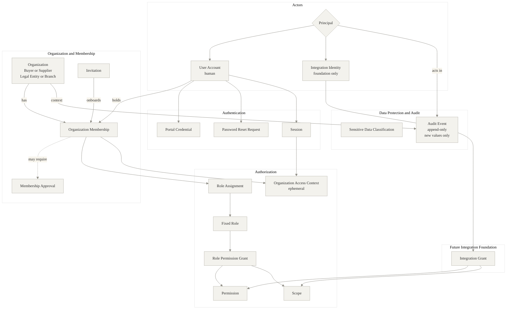

---

# 3. Entity and Concept Summary

| Concept | Kind | Meaning | Main decisions |
|---|---|---|---|
| **Principal** | Abstract actor | Anything recognized as an actor by the domain | M18-01A |
| **User Account** | Persistent domain entity | One human person's global portal identity | M18-01A, M18-03, M18-10, M18-12 |
| **Integration Identity** | Persistent foundation entity | One non-human identity for one external system/integration | M18-01A, M18-41A |
| **Organization** | Persistent domain entity | A buyer-side or supplier-side legal entity/branch | M18-02, M18-04 |
| **Invitation** | Persistent domain concept | A controlled request to onboard a person into an Organization | M18-07, M18-08, M18-09, M18-45 |
| **Organization Membership** | Persistent domain entity | The relationship between a User Account and an Organization | M18-03, M18-09, M18-10, M18-11 |
| **Membership Approval** | Persistent domain concept | Buyer-side decision required for Supplier Admin authority | M18-09, M18-29, M18-32 |
| **Role** | Fixed catalog concept | A named bundle of human-user authorization grants | M18-01B, M18-21 |
| **Role Assignment** | Persistent domain entity | Assigns a Role to one Organization Membership | M18-01A, M18-27, M18-28 |
| **Permission** | Catalog/value concept | An explicit action on a resource type | M18-23 |
| **Scope** | Catalog/value concept | The record set on which a Permission applies | M18-20, M18-24 |
| **Role Permission Grant** | Authorization concept | One Permission + Scope pair contained by a Role | M18-24, M18-28 |
| **Integration Grant** | Authorization foundation | One Permission + Scope pair assigned to an Integration Identity | M18-01A, M18-41A |
| **Portal Credential** | Authentication concept | The MVP authentication method for a User Account | M18-14 |
| **Password Reset Request** | Persistent security concept | A request that enables password recovery through an email link | M18-16 |
| **Session** | Persistent security concept | One concurrent authenticated login session | M18-17, M18-43, M18-45 |
| **Organization Access Context** | Ephemeral concept | The exact active Membership under which a request is authorized | M18-10, M18-24, M18-28 |
| **Sensitive Data Classification** | Metadata concept | Marks data elements whose values must be redacted for some viewers | M18-25 |
| **Audit Event** | Persistent immutable entity | Records important identity, security, business, approval, and administration events | M18-32, M18-33, M18-35, M18-37, M18-39 |

---

# 4. Organization Model

## 4.1 Organization classifications

Every Organization is conceptually classified along two independent dimensions.

### Organization side

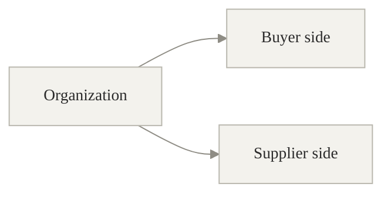

- The portal is operated for one buyer side.
- Supplier companies are Organizations, not tenants.
- Buyer-side and supplier-side memberships use different Role families.

### Organization unit kind

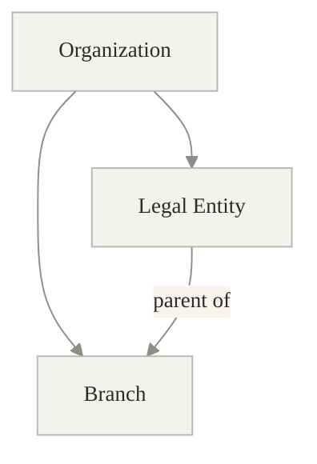

- A Legal Entity is represented as an Organization.
- A Branch is represented as a child Organization under a Legal Entity Organization.
- The exact persistence representation of these classifications belongs to technical design.

## 4.2 Role compatibility

### Buyer-side Roles

```text
Portal Admin
Auditor
Buyer
Approver
Finance User
Quality User
```

These Roles may be assigned only through a Membership in a buyer-side Organization.

### Supplier-side Roles

```text
Supplier Admin
Supplier User
```

These Roles may be assigned only through a Membership in a supplier-side Organization.

This prevents invalid combinations such as assigning `Buyer` to a supplier Membership or `Supplier Admin` to a buyer Membership.

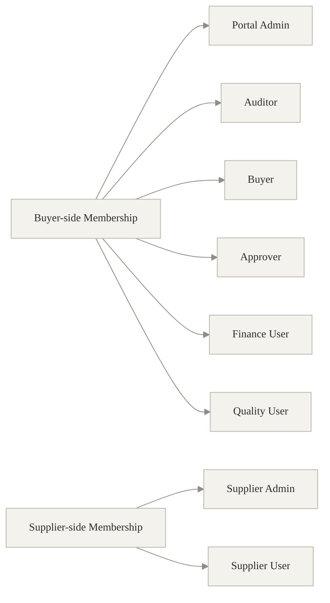

## 4.3 Organization hierarchy invariant

```text
A Branch belongs to one parent Legal Entity Organization.
A Legal Entity is not a child Branch.
```

Whether a Legal Entity Scope automatically includes all child Branch records must be made explicit in the relevant module's technical design and must not silently broaden access beyond M18-24.

---

# 5. Conceptual Relationships

The inheritance relationships in this diagram are conceptual and do not require relational-table inheritance.

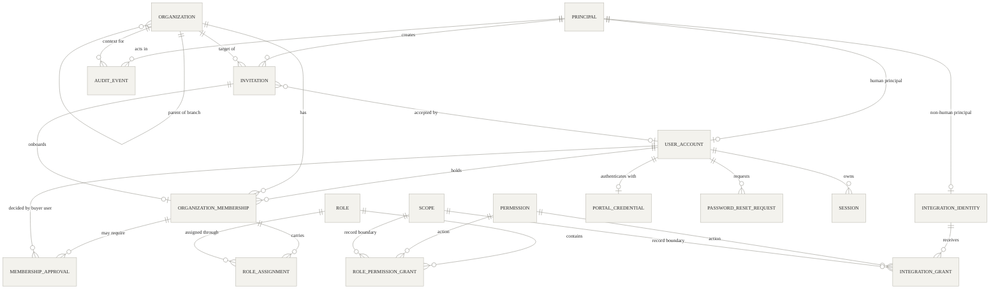

### Relationship invariants

- A User Account may hold multiple Organization Memberships.
- Losing one Membership must not automatically end another Membership.
- Human Roles are assigned only through a Membership.
- Integration Identities never hold Memberships and never receive human Roles.
- A Role Assignment from one Membership never authorizes work under another Membership.
- A Role contains explicit Permission + Scope grants; Scope is not inferred from a Role name alone.
- An Invitation targets one Organization and one proposed onboarding relationship.
- Existing User Accounts are reused; an Invitation must not create a duplicate User Account for the same person.
- A Session belongs to the global User Account, while organization-scoped authorization is evaluated under one active Membership context.

---

# 6. Core Concept Definitions

## 6.1 Principal

Principal is the abstract actor concept.

Exactly two Principal types exist:

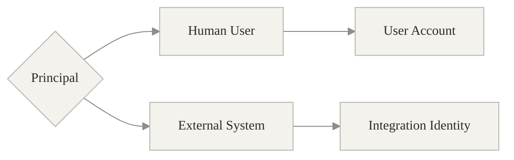

A Role is not a Principal type.

---

## 6.2 User Account

A User Account represents one human person's global portal identity.

### Conceptual information

- Immutable internal identity
- Mutable email login identifier
- Account status
- Verification status
- Security status
- Portal Credential for the MVP
- Zero or more Organization Memberships
- Zero or more concurrent Sessions

### Invariants

- Email changes do not change the internal identity.
- A person must not receive a second User Account merely because they join another Organization.
- Shared human User Accounts are prohibited.
- The User Account lifecycle is independent from every Membership lifecycle.

---

## 6.3 Integration Identity

An Integration Identity represents one external system or integration.

### Invariants

- It is not a human User Account.
- It does not hold Organization Memberships.
- It does not receive Buyer, Supplier Admin, or other human Roles.
- It receives only explicit Integration Grants.
- Unrelated external systems do not share one Integration Identity.
- Test and production do not share an identity or credential.
- It is independently auditable, disableable, and revocable.

### MVP boundary

The entity and grant path are architectural foundations only. The standalone MVP does not connect to CaniasERP, and this model does not define OAuth, API-key, or Canias-specific credential behavior.

---

## 6.4 Invitation

An Invitation represents controlled, invitation-based onboarding.

### Conceptual information

- Inviter Principal
- Recipient email
- Target Organization
- Proposed supplier-side Role or authority
- Intended Organization Membership
- Acceptance information

### Invariants

- Open self-registration does not create Invitations in the MVP.
- The first Supplier Admin Invitation is created by a Buyer or Portal Admin.
- A Supplier Admin may invite Supplier Users only within their own Organization.
- An Invitation for an existing verified User Account reuses that account.
- Email verification is not repeated when the existing verified email has not changed.
- Invitation acceptance does not bypass a required Membership Approval.

### Deferred mechanics

The following belong to technical design and must not contradict the decisions:

- Token lifetime
- Single-use behavior
- Expired/revoked/resent behavior
- Transaction and idempotency rules
- Exact persistence timing between Invitation and `INVITED` Membership

---

## 6.5 Organization Membership

An Organization Membership represents one User Account's relationship with one Organization.

### Conceptual information

- User Account
- Organization
- Membership status
- Role Assignments
- Approval requirement, when applicable

### Invariants

- Membership status is separate from account, verification, and security status.
- Only an `ACTIVE` Membership may provide organization business access.
- Ending a Membership does not disable the User Account when another active Membership exists.
- An inactive Membership provides no effective authorization even if historical Role Assignments remain associated with it.
- Roles are evaluated only within the exact Membership selected as the Organization Access Context.

---

## 6.6 Membership Approval

Membership Approval is a specific approval concept for Supplier Admin authority. It is **not** a general workflow engine.

It is required for:

- The first Supplier Admin of a supplier Organization
- An additional Supplier Admin
- A replacement Supplier Admin

It is not required for routine Supplier User Invitations made by an already approved Supplier Admin.

### Conceptual information

- Membership or proposed Supplier Admin authority being reviewed
- Requesting actor
- Buyer-side deciding user
- Decision result
- Decision time
- Reason or note, when supplied

### Invariants

- Email verification and Buyer approval are separate gates.
- The person who opened a request must not approve the same request when segregation of duties applies.
- Approval and rejection actions are Audit Events.

---

## 6.7 Role and Role Assignment

Role is a fixed, named bundle of Role Permission Grants.

Role Assignment connects one Role to one Organization Membership.

### Fixed Role catalog

```text
Portal Admin
Auditor
Buyer
Approver
Finance User
Quality User
Supplier Admin
Supplier User
```

### Invariants

- Custom Roles are not part of the MVP.
- Portal Admin assigns buyer-side/internal Roles.
- Supplier Admin assigns supplier-side Roles within their own Organization.
- Supplier Admin appointments remain subject to Buyer approval.
- `GLOBAL` Scope does not allow an action that the Role has not explicitly been granted.
- A broad `manage_all` Permission is not an accepted shortcut.

---

## 6.8 Permission, Scope, and Role Permission Grant

Permission answers:

> What action may be performed on what resource type?

Examples:

```text
view supplier
edit membership
invite supplier-user
approve supplier-admin-membership
export audit-event
```

Scope answers:

> Which records may that Permission operate on?

### Scope catalog

```text
GLOBAL
BUYER_ORGANIZATION
LEGAL_ENTITY
BUSINESS_UNIT
SUPPLIER_ORGANIZATION
ASSIGNED_RECORDS
OWN_RECORDS
```

`READ_ONLY` is not a Scope. Read-only behavior is expressed through read-oriented Permissions.

### Role Permission Grant

```text
Role Permission Grant = Permission + Scope
```

A Role Assignment may narrow the concrete organization/legal-entity context but must not broaden the Scope defined by the Role Permission Grant.

---

## 6.9 Integration Grant

Integration Grant is the non-human equivalent of an explicit Permission + Scope grant.

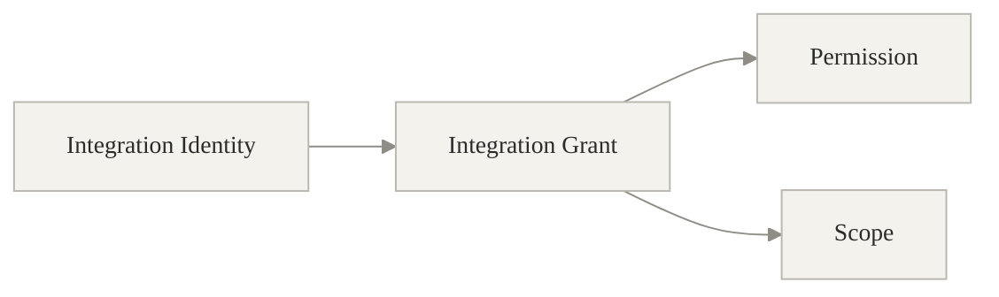

It is intentionally separate from human Role Assignment.

No operational Integration Grants need to be configured in the standalone MVP because no ERP integration is implemented.

---

## 6.10 Portal Credential

Portal Credential is the MVP authentication method for a User Account.

### Conceptual rules

- It belongs to the User Account, not to a Membership.
- It is not shared between people.
- Its secrets must never be written to Audit Events.
- The exact password hashing, storage, rotation, and token format belong to technical design.
- Future SSO must not require changing the meaning of User Account or Organization Membership.

---

## 6.11 Password Reset Request

Password Reset Request represents email-link account recovery.

### Conceptual rules

- It targets one User Account and its Portal Credential.
- It must not expose or log credential secrets.
- Exact token lifetime, single-use handling, resend behavior, and invalidation belong to technical design.

---

## 6.12 Session

A Session represents one authenticated login session.

The MVP permits multiple concurrent Sessions per User Account.

### Conceptual information

- User Account
- Start time
- Last activity time
- Absolute expiry boundary
- Session state
- Revocation reason, when revoked

### Important distinction

A Session authenticates the global User Account. An organization-scoped operation is authorized separately through an Organization Access Context that references one active Membership.

This allows one User Account to retain access to Organization B when its Membership in Organization A is ended.

---

## 6.13 Organization Access Context

Organization Access Context is an ephemeral authorization concept used during a request or interaction.

It contains:

- Authenticated User Account
- Authenticated Session
- Exactly one selected active Organization Membership
- Effective Role Permission Grants for that Membership

### Invariants

- Organization-scoped work must execute under exactly one Membership context.
- Grants from another Membership must not participate in authorization.
- The context becomes invalid when the selected Membership is no longer `ACTIVE`.
- Technical design may represent this context in a session, token claim, request object, or another mechanism, but the domain meaning must remain unchanged.

---

## 6.14 Sensitive Data Classification

This is a metadata concept, not a general field-level permission engine.

A business module may mark specific data elements as sensitive, for example:

```text
bank details
tax identifiers
internal risk data
discount information
```

When returning data, the system evaluates the viewer's Role and Organization context and redacts values that the viewer must not see.

The sensitive-field catalog is defined during the technical design of each relevant business module.

---

## 6.15 Audit Event

Audit Event is an append-only record of an important domain or security action.

### Event categories

```text
IDENTITY_AND_ACCESS
SECURITY
BUSINESS_DATA_CHANGE
APPROVAL
ADMINISTRATION
```

### Visibility classifications

```text
INTERNAL_ONLY
SUPPLIER_VISIBLE
AUDITOR_ONLY
SECURITY_ONLY
```

### Conceptual shape

```text
Audit Event
- actor: Principal
- action
- target resource type
- target resource identifier
- organization context, when applicable
- timestamp
- result
- event category
- visibility classification
- changed_fields, when applicable
- new_values, when applicable
```

```mermaid
%%{init: {"theme": "base", "themeVariables": {"background": "#ffffff", "primaryColor": "#f3f2ed", "primaryTextColor": "#2b2b2b", "primaryBorderColor": "#b9b7ae", "lineColor": "#8f8d85", "secondaryColor": "#faf9f6", "tertiaryColor": "#ffffff", "edgeLabelBackground": "#f7f4ec", "fontFamily": "Georgia, Times New Roman, serif", "fontSize": "14px"}, "flowchart": {"curve": "basis", "htmlLabels": true}, "sequence": {"mirrorActors": false}, "er": {"useMaxWidth": true}}}%%
flowchart TB
    AE[Audit Event]
    AE --> A[Actor]
    AE --> AC[Action]
    AE --> T[Target resource]
    AE --> OC[Organization context]
    AE --> TS[Timestamp]
    AE --> R[Result]
    AE --> C[Event category]
    AE --> V[Visibility class]
    AE --> CF[Changed fields]
    AE --> NV[Resulting new values]
    AE -. does not contain .-> OV[Old values]
    AE -. never contains .-> SEC[Authentication secrets]

```

### Explicitly absent

```text
old_values
```

Previous values are not stored in the MVP Audit Event.

### Audit invariants

- Audit Events are append-only and cannot be edited or manually deleted.
- Create events may store created values in `new_values`.
- Update events store only changed fields and their resulting values.
- Delete events identify the deleted resource but do not store a full pre-deletion snapshot.
- Passwords, password hashes, reset tokens, session tokens, API keys, client secrets, private keys, and similar secrets are never stored.
- Audit Events are not a complete record-version history.
- Technical logs and distributed traces are not Audit Events.
- Retention behavior is not modeled until M18-36 is accepted.

---

# 7. State Models

The four identity/access state dimensions are independent.

## 7.1 User Account — account status

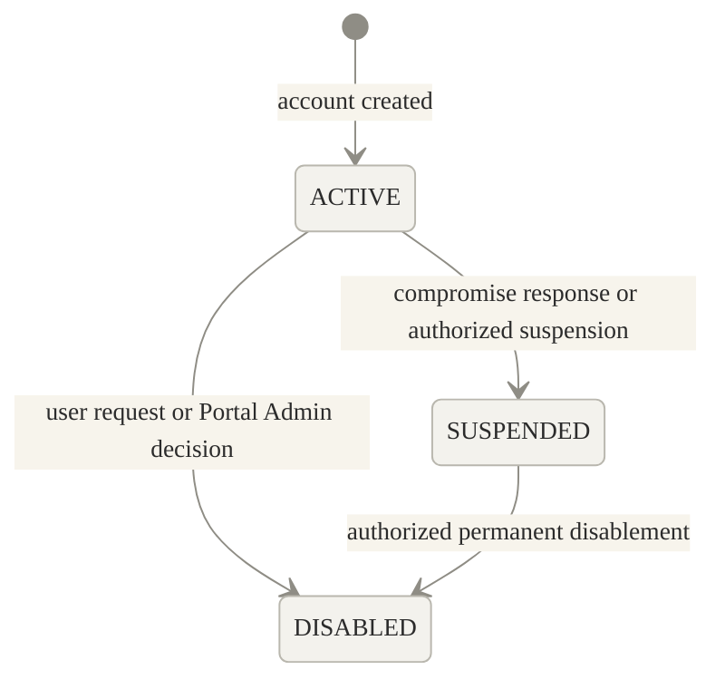

Transitions back from `SUSPENDED` or `DISABLED` are not defined by the accepted decisions and must not be invented in technical design.

---

## 7.2 User Account — verification status

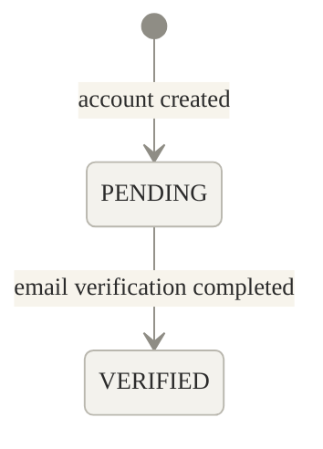

An already verified account whose verified email has not changed is not re-verified merely because a new Invitation is accepted.

---

## 7.3 User Account — security status

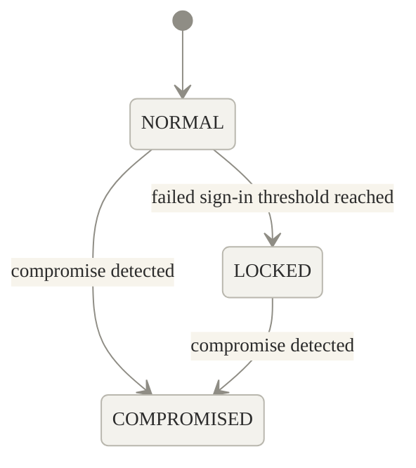

When compromise is detected:

```text
account_status → SUSPENDED
active Sessions → REVOKED
```

Recovery from `LOCKED` or `COMPROMISED` is not fully defined in the accepted decisions. Thresholds, lockout duration, unlock rules, and recovery mechanics belong to technical design or a follow-up decision where necessary.

---

## 7.4 Organization Membership — membership status

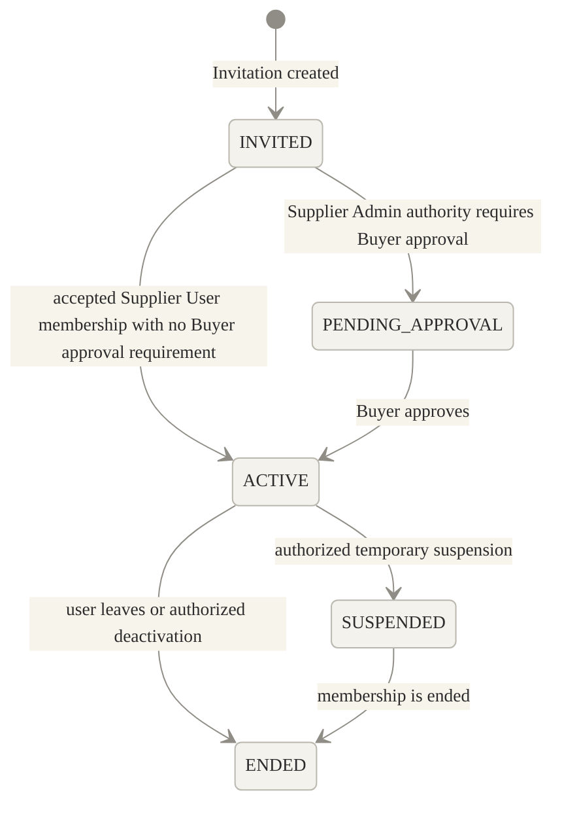

The accepted decisions do not fully define:

- Representation of a rejected approval
- Reactivation from `SUSPENDED`
- Whether an expired/revoked Invitation immediately ends an `INVITED` Membership

These must be resolved before implementing the relevant transition.

### Effective access rule

A Membership being `ACTIVE` is necessary but not sufficient. The User Account must also satisfy the authentication predicate.

---

## 7.5 Membership Approval

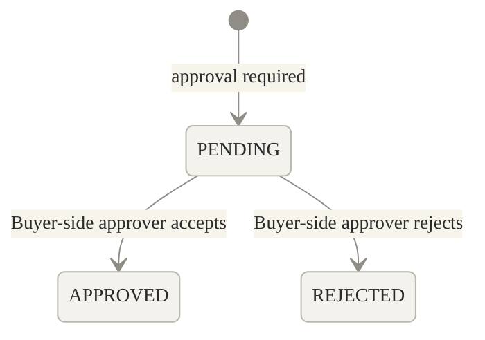

How a `REJECTED` approval affects the associated Membership status must be made explicit before implementation; this model does not silently map it to `ENDED`.

---

## 7.6 Session

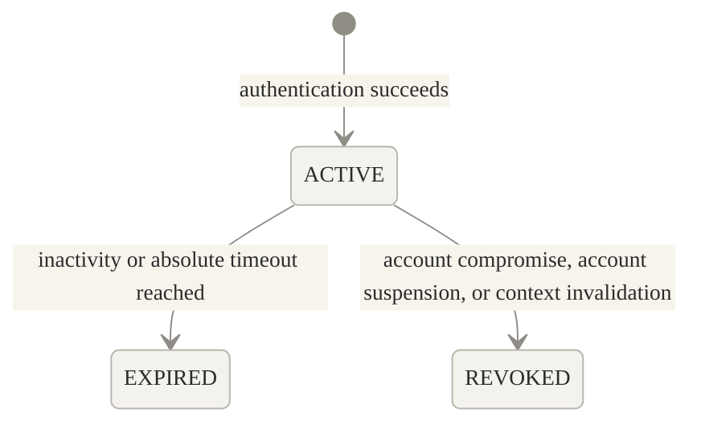

### Session behavior

- Multiple Sessions may be `ACTIVE` concurrently for one User Account.
- Single-active-session enforcement is later phase.
- Ending a Membership invalidates use of that Membership context.
- Technical design determines whether this revokes the entire Session or only prevents that Session from using the ended Membership; it must preserve access to unrelated active Memberships.

---

# 8. Effective Authentication and Authorization

## 8.1 Authentication predicate

A User Account may authenticate only when:

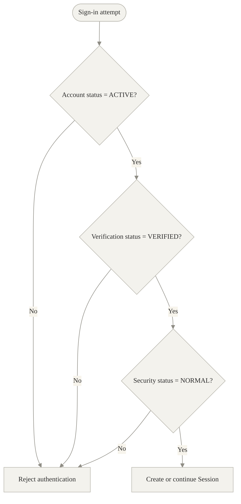

A verified user without an active Membership may access only a restricted account/membership-status experience and may not access organization business data.

## 8.2 Organization authorization predicate

A human user may perform an organization-scoped action only when:

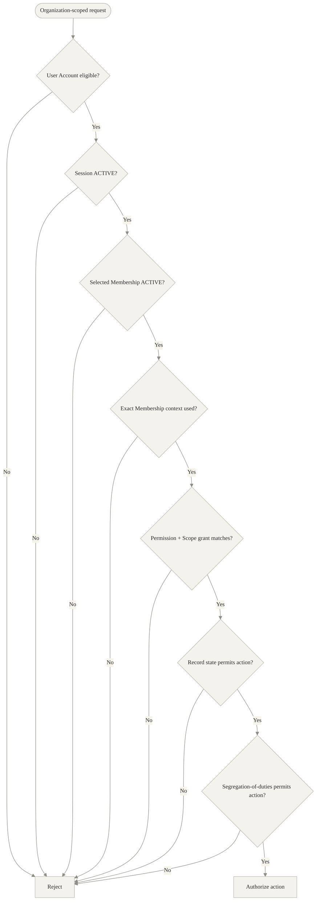

## 8.3 Human authorization path

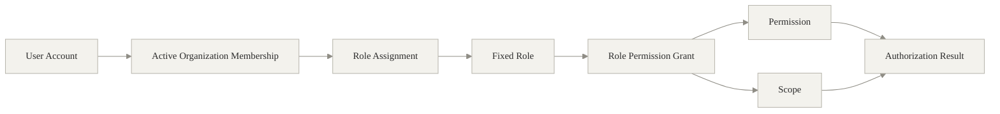

## 8.4 Integration authorization path

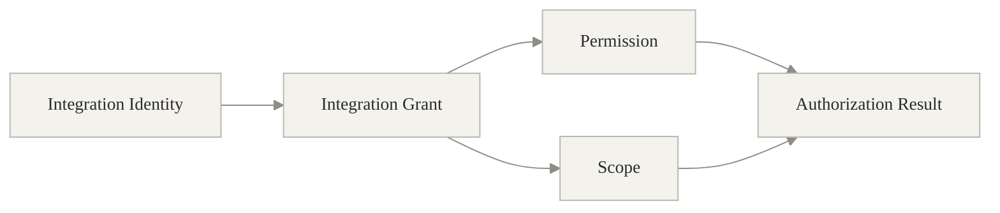

This second path is architectural foundation only and is not exercised by the standalone MVP.

## 8.5 Multiple Roles

Within one active Membership:

- Explicit Role Permission Grants are unioned.
- There is no explicit deny in the MVP.
- Every grant keeps its own Permission and Scope.
- The system must not invent a broader Scope.
- One Role's Scope must not be applied to another Role's Permission.

Example:

```text
Role A: view invoice + LEGAL_ENTITY
Role B: approve invoice + ASSIGNED_RECORDS
```

Effective grants remain:

```text
view invoice + LEGAL_ENTITY
approve invoice + ASSIGNED_RECORDS
```

The system must not create:

```text
approve invoice + LEGAL_ENTITY
```

---

# 9. Normative MVP Scope Baseline

| Role | Data Scope | Permission character |
|---|---|---|
| Portal Admin | `GLOBAL` | Only explicit administration Permissions |
| Auditor | `GLOBAL` | Read/export only |
| Buyer | `ASSIGNED_RECORDS` | Buyer actions on assigned records |
| Approver | `ASSIGNED_RECORDS` | View/approve on assigned records |
| Finance User | `LEGAL_ENTITY` | Finance actions within assigned legal entity context |
| Quality User | `LEGAL_ENTITY` | Quality actions within assigned legal entity context |
| Supplier Admin | `SUPPLIER_ORGANIZATION` | Supplier administration within own Organization |
| Supplier User | `SUPPLIER_ORGANIZATION` | Limited supplier actions within own Organization |

The complete resource-to-Permission matrix belongs to technical design. Technical design may define explicit actions but must not broaden these Scope boundaries without updating the decision log.

---

# 10. Onboarding and Membership Flows

## 10.1 First Supplier Admin

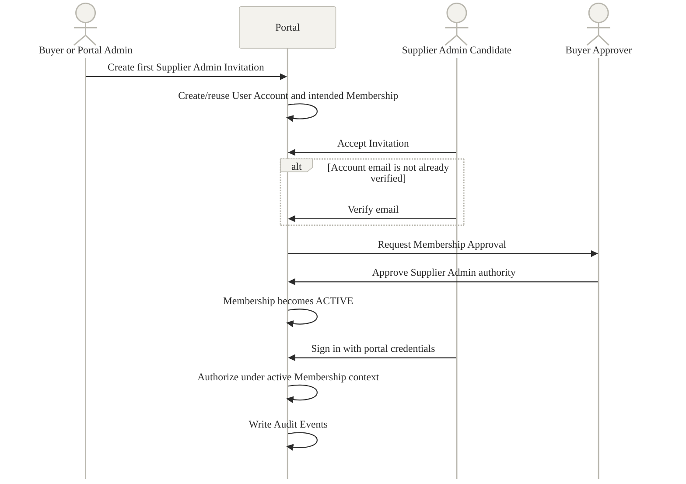

### Invariants

- The first Supplier Admin requires Buyer approval.
- Verification and approval are separate.
- The Membership provides no organization business access before it is `ACTIVE`.
- The Role becomes effective only through the active Membership.

---

## 10.2 Supplier User invited by approved Supplier Admin

```mermaid
%%{init: {"theme": "base", "themeVariables": {"background": "#ffffff", "primaryColor": "#f3f2ed", "primaryTextColor": "#2b2b2b", "primaryBorderColor": "#b9b7ae", "lineColor": "#8f8d85", "secondaryColor": "#faf9f6", "tertiaryColor": "#ffffff", "edgeLabelBackground": "#f7f4ec", "fontFamily": "Georgia, Times New Roman, serif", "fontSize": "14px"}, "flowchart": {"curve": "basis", "htmlLabels": true}, "sequence": {"mirrorActors": false}, "er": {"useMaxWidth": true}}}%%
sequenceDiagram
    actor Admin as Approved Supplier Admin
    participant Portal
    actor Recipient as Supplier User Candidate

    Admin->>Portal: Create Supplier User Invitation
    Portal->>Portal: Confirm inviter belongs to target Organization
    Recipient->>Portal: Accept Invitation
    alt Existing User Account found
        Portal->>Portal: Reuse User Account
    else No existing User Account
        Portal->>Portal: Create User Account
    end
    alt Email is not already verified
        Recipient->>Portal: Verify email
    end
    Portal->>Portal: Activate Supplier User Membership
    Portal->>Portal: Make supplier-side Role Assignment effective
    Portal->>Portal: Write Audit Events
```

The Supplier Admin may perform this only within their own supplier Organization.

---

## 10.3 Additional or replacement Supplier Admin

```mermaid
%%{init: {"theme": "base", "themeVariables": {"background": "#ffffff", "primaryColor": "#f3f2ed", "primaryTextColor": "#2b2b2b", "primaryBorderColor": "#b9b7ae", "lineColor": "#8f8d85", "secondaryColor": "#faf9f6", "tertiaryColor": "#ffffff", "edgeLabelBackground": "#f7f4ec", "fontFamily": "Georgia, Times New Roman, serif", "fontSize": "14px"}, "flowchart": {"curve": "basis", "htmlLabels": true}, "sequence": {"mirrorActors": false}, "er": {"useMaxWidth": true}}}%%
sequenceDiagram
    actor Requester as Supplier Admin or Portal Actor
    participant Portal
    actor Candidate as Supplier Admin Candidate
    actor Buyer as Buyer Approver

    Requester->>Portal: Request Supplier Admin appointment
    Candidate->>Portal: Accept Invitation when required
    alt Email is not already verified
        Candidate->>Portal: Verify email
    end
    Portal->>Buyer: Request approval
    Buyer->>Portal: Approve or reject appointment
    alt Approved
        Portal->>Portal: Activate Membership and Supplier Admin Role
    else Rejected
        Portal->>Portal: Keep authority ineffective
    end
    Portal->>Portal: Write Approval Audit Event
```

The model does not introduce a general approval workflow engine for this process.

---

## 10.4 Existing User Account reuse

```mermaid
%%{init: {"theme": "base", "themeVariables": {"background": "#ffffff", "primaryColor": "#f3f2ed", "primaryTextColor": "#2b2b2b", "primaryBorderColor": "#b9b7ae", "lineColor": "#8f8d85", "secondaryColor": "#faf9f6", "tertiaryColor": "#ffffff", "edgeLabelBackground": "#f7f4ec", "fontFamily": "Georgia, Times New Roman, serif", "fontSize": "14px"}, "flowchart": {"curve": "basis", "htmlLabels": true}, "sequence": {"mirrorActors": false}, "er": {"useMaxWidth": true}}}%%
flowchart TD
    I[Invitation accepted] --> E{Matching User Account exists?}
    E -- No --> C[Create one User Account]
    E -- Yes --> R[Reuse existing User Account]
    C --> M[Create or link intended Membership]
    R --> M
    M --> P[Preserve unrelated Memberships]
    P --> V{Same email already VERIFIED?}
    V -- Yes --> SKIP[Skip repeat verification]
    V -- No --> VERIFY[Complete email verification]

```

---

## 10.5 Membership ending

```mermaid
%%{init: {"theme": "base", "themeVariables": {"background": "#ffffff", "primaryColor": "#f3f2ed", "primaryTextColor": "#2b2b2b", "primaryBorderColor": "#b9b7ae", "lineColor": "#8f8d85", "secondaryColor": "#faf9f6", "tertiaryColor": "#ffffff", "edgeLabelBackground": "#f7f4ec", "fontFamily": "Georgia, Times New Roman, serif", "fontSize": "14px"}, "flowchart": {"curve": "basis", "htmlLabels": true}, "sequence": {"mirrorActors": false}, "er": {"useMaxWidth": true}}}%%
sequenceDiagram
    actor Admin as Authorized Administrator
    participant Portal
    participant MA as Membership A
    participant MB as Membership B
    participant Session
    participant Audit

    Admin->>Portal: End Membership A
    Portal->>MA: Set status to ENDED
    Portal->>MA: Make Role Assignments ineffective
    Portal->>Session: Invalidate Membership A context
    Portal->>MB: Preserve unrelated active Membership
    Portal->>Portal: Keep global User Account active when applicable
    Portal->>Audit: Record membership-ending event
```

---

# 11. Password Recovery and Sign-In Security

## 11.1 Password recovery

```mermaid
%%{init: {"theme": "base", "themeVariables": {"background": "#ffffff", "primaryColor": "#f3f2ed", "primaryTextColor": "#2b2b2b", "primaryBorderColor": "#b9b7ae", "lineColor": "#8f8d85", "secondaryColor": "#faf9f6", "tertiaryColor": "#ffffff", "edgeLabelBackground": "#f7f4ec", "fontFamily": "Georgia, Times New Roman, serif", "fontSize": "14px"}, "flowchart": {"curve": "basis", "htmlLabels": true}, "sequence": {"mirrorActors": false}, "er": {"useMaxWidth": true}}}%%
sequenceDiagram
    actor User
    participant Portal
    participant Mail as Email Delivery
    participant Credential as Portal Credential
    participant Audit

    User->>Portal: Request password reset
    Portal->>Portal: Create Password Reset Request
    Portal->>Mail: Send reset link
    User->>Portal: Submit valid reset request
    Portal->>Credential: Replace credential secret
    Portal->>Audit: Record recovery event without secrets
```

Exact token mechanics belong to technical design.

## 11.2 Failed sign-ins

```mermaid
%%{init: {"theme": "base", "themeVariables": {"background": "#ffffff", "primaryColor": "#f3f2ed", "primaryTextColor": "#2b2b2b", "primaryBorderColor": "#b9b7ae", "lineColor": "#8f8d85", "secondaryColor": "#faf9f6", "tertiaryColor": "#ffffff", "edgeLabelBackground": "#f7f4ec", "fontFamily": "Georgia, Times New Roman, serif", "fontSize": "14px"}, "flowchart": {"curve": "basis", "htmlLabels": true}, "sequence": {"mirrorActors": false}, "er": {"useMaxWidth": true}}}%%
flowchart TD
    F[Failed sign-in] --> A[Record SECURITY Audit Event where applicable]
    A --> T[Apply account-based throttling]
    T --> X{Threshold reached?}
    X -- No --> WAIT[Keep monitoring]
    X -- Yes --> L[Set security status to LOCKED]

```

Thresholds, windows, duration, and unlock behavior belong to technical design unless they change the business policy.

## 11.3 Compromised account

```mermaid
%%{init: {"theme": "base", "themeVariables": {"background": "#ffffff", "primaryColor": "#f3f2ed", "primaryTextColor": "#2b2b2b", "primaryBorderColor": "#b9b7ae", "lineColor": "#8f8d85", "secondaryColor": "#faf9f6", "tertiaryColor": "#ffffff", "edgeLabelBackground": "#f7f4ec", "fontFamily": "Georgia, Times New Roman, serif", "fontSize": "14px"}, "flowchart": {"curve": "basis", "htmlLabels": true}, "sequence": {"mirrorActors": false}, "er": {"useMaxWidth": true}}}%%
flowchart LR
    C[Compromise detected] --> SS[security status = COMPROMISED]
    C --> AS[account status = SUSPENDED]
    C --> SR[Revoke active Sessions]
    C --> AE[Write SECURITY Audit Event]

```

Recovery behavior requires explicit design and must not be invented from the existence of the `COMPROMISED` state.

---

# 12. Audit Model

## 12.1 Audit purpose

```mermaid
%%{init: {"theme": "base", "themeVariables": {"background": "#ffffff", "primaryColor": "#f3f2ed", "primaryTextColor": "#2b2b2b", "primaryBorderColor": "#b9b7ae", "lineColor": "#8f8d85", "secondaryColor": "#faf9f6", "tertiaryColor": "#ffffff", "edgeLabelBackground": "#f7f4ec", "fontFamily": "Georgia, Times New Roman, serif", "fontSize": "14px"}, "flowchart": {"curve": "basis", "htmlLabels": true}, "sequence": {"mirrorActors": false}, "er": {"useMaxWidth": true}}}%%
flowchart LR
    AE[Audit Event] --> WHO[Who acted?]
    AE --> WHEN[When?]
    AE --> TARGET[Which resource?]
    AE --> ACTION[What action?]
    AE --> NEW[What resulting values?]
    AE --> RESULT[Success or failure?]

    AE -. does not answer .-> OLD[What was the previous value?]
    AE -. cannot guarantee .-> HISTORY[Complete record reconstruction]

```

## 12.2 Values stored

### Create

```text
changed_fields: created fields, when useful
new_values: created resulting values, when permitted
```

### Update

```text
changed_fields: only fields changed by the operation
new_values: only resulting values for those fields
```

### Delete

```text
action: deletion
target: resource type + identifier
actor/context/time/result
no full pre-deletion snapshot
```

## 12.3 Values never stored

```text
old_values
passwords
password hashes
reset tokens
session tokens
API keys
client secrets
private keys
other authentication secrets
```

## 12.4 Visibility

- Portal Admin receives basic internal audit viewing in the MVP.
- Auditor and Portal Admin are conceptually allowed to see all visibility classes.
- Supplier Admin may see only own-Organization events classified `SUPPLIER_VISIBLE` when the supplier-facing audit UI is delivered.
- Full visibility UI, export, and reporting are later phase.

## 12.5 Audit versus observability

```mermaid
%%{init: {"theme": "base", "themeVariables": {"background": "#ffffff", "primaryColor": "#f3f2ed", "primaryTextColor": "#2b2b2b", "primaryBorderColor": "#b9b7ae", "lineColor": "#8f8d85", "secondaryColor": "#faf9f6", "tertiaryColor": "#ffffff", "edgeLabelBackground": "#f7f4ec", "fontFamily": "Georgia, Times New Roman, serif", "fontSize": "14px"}, "flowchart": {"curve": "basis", "htmlLabels": true}, "sequence": {"mirrorActors": false}, "er": {"useMaxWidth": true}}}%%
flowchart TB
    APP[Portal activity] --> BIZ[Business audit channel]
    APP --> OPS[Operational observability channel]

    BIZ --> AE[Audit Event]
    BIZ --> LC[Business lifecycle event]

    OPS --> EL[Application error log]
    OPS --> OL[Operational log]
    OPS --> TR[Distributed trace or span]

    AE -. not equivalent to .-> VH[Complete record-version history]

```

Technical logs and traces use a separate operational observability channel from the beginning.

---

# 13. Conceptual Invariants Checklist

## Identity

- [x] Principal type and Role are different concepts.
- [x] Human User and Integration Identity are different Principal types.
- [x] One person's email change does not change their internal User Account identity.
- [x] Existing User Accounts are reused across Organizations.
- [x] Shared human accounts are prohibited.

## Organization and Membership

- [x] Suppliers are Organizations, not tenants.
- [x] Legal Entities are Organizations; Branches are child Organizations.
- [x] Account lifecycle and Membership lifecycle are independent.
- [x] One User Account may hold multiple Memberships.
- [x] Ending one Membership does not automatically disable the global account.

## Authorization

- [x] Human Roles are assigned only through Memberships.
- [x] Integration Identities receive Integration Grants, not human Roles.
- [x] Permission and Scope remain paired in explicit grants.
- [x] `GLOBAL` is not an authorization bypass.
- [x] `READ_ONLY` is not a Scope.
- [x] Grants never cross Membership contexts.
- [x] Multiple Roles union explicit grants without inventing broader Scope.
- [x] State-dependent authorization and segregation of duties remain additional checks.

## Authentication and Session

- [x] Authentication requires ACTIVE + VERIFIED + NORMAL.
- [x] Organization access additionally requires an ACTIVE Membership.
- [x] Multiple concurrent Sessions are allowed in the MVP.
- [x] Membership context invalidation must preserve unrelated active Membership access.

## Audit

- [x] Audit Events are append-only.
- [x] Changed fields and resulting new values are stored.
- [x] Previous values are not stored.
- [x] Secrets are never stored.
- [x] Audit is not treated as full version history.
- [x] Technical logs and traces are separate.

## MVP boundary

- [x] No self-registration.
- [x] No ERP synchronization.
- [x] No Integration Identity authentication mechanism is selected.
- [x] No MFA, SSO, custom Roles, delegation, impersonation, or break-glass workflow.
- [x] No general-purpose field-level authorization engine.

---

# 14. Explicitly Deferred or Open

## Open decision M18-36 — Audit retention

Not modeled:

- Retention duration
- Category-specific retention
- Archival timing
- Anonymization timing
- Automated deletion

Temporary decision-log default remains: no automatic deletion until M18-36 is accepted.

## Open decision M18-41B — Integration authentication

Not modeled:

- OAuth Client Credentials
- API credential format
- Canias-specific service credential
- Credential rotation mechanics
- Integration authentication protocol

The conceptual boundary is only:

```mermaid
%%{init: {"theme": "base", "themeVariables": {"background": "#ffffff", "primaryColor": "#f3f2ed", "primaryTextColor": "#2b2b2b", "primaryBorderColor": "#b9b7ae", "lineColor": "#8f8d85", "secondaryColor": "#faf9f6", "tertiaryColor": "#ffffff", "edgeLabelBackground": "#f7f4ec", "fontFamily": "Georgia, Times New Roman, serif", "fontSize": "14px"}, "flowchart": {"curve": "basis", "htmlLabels": true}, "sequence": {"mirrorActors": false}, "er": {"useMaxWidth": true}}}%%
flowchart LR
    ES[External system] --> II[Separate Integration Identity]
    II --> IG[Explicit Integration Grants]
    IG --> P[Permission]
    IG --> S[Scope]
    ES -. authentication mechanism still open .-> AUTH[OAuth, API credential, or Canias-specific method]

```

## Later-phase capabilities

No conceptual entities are introduced yet for:

- Custom Role administration
- Delegation
- Impersonation
- Break-glass access grant
- Security alerts
- Full business record versioning
- ERP synchronization mappings/jobs/events

---

# 15. Questions to Resolve in Technical Design

These questions may choose implementation mechanics but must not change the accepted business rules.

## Invitation and activation

1. Invitation token lifetime and single-use enforcement
2. Expired, revoked, and resent Invitation behavior
3. Exact transaction boundary for account reuse, Membership creation, Role Assignment, and activation
4. Idempotency behavior when acceptance or approval is submitted more than once
5. Exact representation of a rejected Membership Approval

## Authentication and recovery

6. Password hashing and credential storage
7. Password Reset Request lifetime and single-use behavior
8. Lockout threshold, observation window, duration, and unlock process
9. Account recovery behavior after `COMPROMISED`

## Sessions

10. Session storage and representation
11. Inactivity and absolute timeout values
12. Membership-context switching mechanism
13. Whether ending one Membership revokes an entire Session or only invalidates that Membership context

## Authorization

14. Resource-specific Permission matrix for every MVP Role
15. Concrete narrowing representation for Legal Entity, Organization, assigned-record, and own-record Scopes
16. Branch access inheritance under `LEGAL_ENTITY` Scope
17. Historical handling of Role Assignments after a Membership becomes inactive

## Sensitive data

18. Sensitive-field catalog for each MVP business module
19. Redaction form: omission, mask, partial display, or replacement marker

## Audit

20. Exact Audit Event names
21. Visibility-class mapping for every event type
22. Result and failure payload conventions
23. Treatment of purely system-triggered events without adding a third Principal type
24. Basic Portal Admin audit-view filters and pagination

---

# 16. First Vertical Slice Coverage

The first vertical slice exercises this conceptual path:

```text
Buyer or Portal Admin
→ Invitation
→ existing or new User Account
→ email verification where required
→ Organization Membership
→ Membership Approval where required
→ Supplier Admin Role Assignment
→ Portal Credential sign-in
→ Session
→ Organization Access Context
→ Role Permission Grant evaluation
→ Membership ending
→ Membership-context invalidation
→ Audit Events containing changed fields and resulting new values
```

### Decision IDs exercised

```text
M18-01A
M18-01B
M18-03
M18-06
M18-07
M18-08
M18-09
M18-10
M18-11
M18-12
M18-13
M18-14
M18-17
M18-20
M18-23
M18-24
M18-27
M18-28
M18-32
M18-33
M18-35
M18-37
M18-45
```

---

# 17. Phase 2 Completion Checklist

- [x] Principal types represented without mixing them with Roles.
- [x] User Account and Organization Membership modeled separately.
- [x] Buyer/supplier and Legal Entity/Branch Organization meanings represented.
- [x] Invitation-based onboarding represented.
- [x] Supplier Admin Membership Approval represented without introducing a generic workflow engine.
- [x] Fixed Roles, Role Assignments, Permissions, Scopes, and grants represented.
- [x] Integration Identity foundation represented without selecting an authentication mechanism.
- [x] Account, verification, security, Membership, approval, and Session states represented.
- [x] Effective authentication and organization-access predicates defined.
- [x] Multiple-role evaluation and Scope isolation represented.
- [x] Sensitive-data redaction concept represented.
- [x] Audit Event shape aligned with `new_values`-only decision.
- [x] Audit separated from technical logs, traces, and full record history.
- [x] Standalone MVP boundary represented with no ERP synchronization concepts.
- [x] First vertical slice mapped to conceptual entities and relationships.
- [ ] Technical-design questions resolved in `03-technical-design.md`.
- [ ] M18-36 resolved by the appropriate policy owner.
- [ ] M18-41B resolved before CaniasERP integration design.

---

> **Next document:** `03-technical-design.md` should convert only the MVP concepts and the selected vertical slice into schemas, API contracts, validation rules, authorization checks, transaction boundaries, and tests. It must not implement deferred capabilities or resolve open decisions implicitly.
