# Supplier Portal — System Overview

## 1. Purpose

The Supplier Portal provides a shared platform for buyer-side and supplier-side users to manage:

- Supplier onboarding
- Supplier users
- Access profiles and data restrictions
- RFQ and offer processes
- Amount-based approvals
- Documents and notifications
- Audit records
- Future ERP data access

Finance and quality operations are not managed directly in the portal. Relevant documents and status information may be retrieved from CaniasERP in a later phase.

---

## 2. High-Level Architecture

```mermaid
flowchart TB

    %% =========================
    %% USERS
    %% =========================
    subgraph USERS["Portal Users"]
        PA[Portal Admin]
        BUYER[Buyer]
        APPROVER[Approver]
        SA[Supplier Admin]
        SU[Supplier User]
    end

    %% =========================
    %% IDENTITY AND ACCESS
    %% =========================
    subgraph IAM["Identity and Access Management"]
        ACCOUNT[User Account]

        MEMBERSHIP[
            Organization Membership
            One User = One Membership
        ]

        PROFILE[
            Access Profile
            Permission Combination
        ]

        RESTRICTIONS[
            Access Restrictions
            Company / Region / Branch
        ]

        ACCOUNT --> MEMBERSHIP
        MEMBERSHIP --> PROFILE
        MEMBERSHIP --> RESTRICTIONS
    end

    PA --> ACCOUNT
    BUYER --> ACCOUNT
    APPROVER --> ACCOUNT
    SA --> ACCOUNT
    SU --> ACCOUNT

    %% =========================
    %% SUPPLIER MANAGEMENT
    %% =========================
    subgraph SUPPLIER["Supplier Management"]
        INVITE[Supplier Invitation]
        REGISTRATION[Supplier Registration]
        SUPPLIER_PROFILE[Supplier Profile]
        DOCUMENTS[Supplier Documents]
        USER_MANAGEMENT[Supplier User Management]

        INVITE --> REGISTRATION
        REGISTRATION --> SUPPLIER_PROFILE
        SUPPLIER_PROFILE --> DOCUMENTS
    end

    PA --> INVITE
    BUYER --> INVITE

    SA --> USER_MANAGEMENT
    USER_MANAGEMENT --> ACCOUNT
    USER_MANAGEMENT --> PROFILE
    USER_MANAGEMENT --> RESTRICTIONS

    %% =========================
    %% SOURCING
    %% =========================
    subgraph SOURCING["RFQ and Offer Management"]
        RFQ[RFQ Creation]
        OFFER[Supplier Offer]
        EVALUATION[Offer Evaluation]
        SELECTION[Offer Selection]

        RFQ --> OFFER
        OFFER --> EVALUATION
        EVALUATION --> SELECTION
    end

    BUYER --> RFQ
    SA --> OFFER
    SU --> OFFER
    BUYER --> EVALUATION
    BUYER --> SELECTION

    %% =========================
    %% APPROVAL
    %% =========================
    subgraph APPROVAL["Amount-Based Approval"]
        POLICY[
            Approval Policy
            Process Type + Amount Range
        ]

        DIRECT[Direct Approval]
        PENDING[PENDING_APPROVAL]
        DECISION{Approver Decision}
        APPROVED[APPROVED]
        REJECTED[REJECTED]

        POLICY -->|Within authority limit| DIRECT
        DIRECT --> APPROVED

        POLICY -->|Above authority limit| PENDING
        PENDING --> DECISION

        DECISION -->|Approve| APPROVED
        DECISION -->|Reject| REJECTED
    end

    SELECTION --> POLICY
    APPROVER --> DECISION

    %% =========================
    %% DOCUMENTS AND COMMUNICATION
    %% =========================
    subgraph COLLAB["Documents and Communication"]
        NOTIFICATION[Notifications]
        MESSAGES[Messages]
        STATUS[Process Status Tracking]
        FILES[Document Access]
    end

    SUPPLIER_PROFILE --> FILES
    DOCUMENTS --> FILES

    SOURCING --> NOTIFICATION
    APPROVAL --> NOTIFICATION

    SOURCING --> STATUS
    APPROVAL --> STATUS

    %% =========================
    %% ERP BOUNDARY
    %% =========================
    subgraph INTEGRATION["ERP Integration Boundary"]
        ERP[CaniasERP]
        ERP_FINANCE[Finance Status and Documents]
        ERP_QUALITY[Quality Status and Documents]

        ERP --> ERP_FINANCE
        ERP --> ERP_QUALITY
    end

    ERP_FINANCE --> FILES
    ERP_QUALITY --> FILES

    ERP_FINANCE --> STATUS
    ERP_QUALITY --> STATUS

    %% =========================
    %% AUDIT
    %% =========================
    subgraph GOVERNANCE["Audit and Governance"]
        AUDIT[
            Business Audit
            Who / What / When / Result
        ]
    end

    IAM -. Important actions .-> AUDIT
    SUPPLIER -. Important actions .-> AUDIT
    SOURCING -. Important actions .-> AUDIT
    APPROVAL -. Important actions .-> AUDIT
```



---

## 3. Identity and Access Model

Each user belongs to one Organization Membership in the current model.

```text
User Account
→ Organization Membership
→ Access Profile
→ Access Restrictions
```

### Access Profile

An Access Profile represents a reusable permission combination.

Examples:

```text
Supplier Admin
Supplier User
Buyer
Approver
Read Only User
Regional Buyer
```

An Access Profile answers:

> What actions may the user perform?

Example:

```text
Access Profile: Regional Buyer

Permissions:
- view_rfq
- create_rfq
- evaluate_offer
- select_offer
```

### Access Restrictions

Access Restrictions define the data boundaries of the user.

Possible restrictions:

```text
Company
Legal Entity
Branch
Region
Assigned Records
```

Access Restrictions answer:

> On which records may the user perform those actions?

Example:

```text
User: Buyer A

Access Profile:
Regional Buyer

Restrictions:
Company = ABC Türkiye
Region = Marmara
```

---

## 4. Supplier User Management

The first Supplier Admin is created or approved by the buyer side.

After activation, the Supplier Admin may manage users within their own supplier organization.

```text
Buyer or Portal Admin
→ creates first Supplier Admin
→ Supplier Admin becomes active
→ Supplier Admin creates Supplier Users
→ assigns Access Profiles
→ assigns Company or Region restrictions
→ activates or deactivates users
```

The Supplier Admin must not manage users belonging to another supplier organization.

---

## 5. Amount-Based Approval

Authorization and approval are separate concepts.

Authorization answers:

> Is the user allowed to start or perform the action?

Approval policy answers:

> Can the action be completed directly, or is additional approval required?

Example:

```text
Amount ≤ 100,000 TRY
→ Direct approval

100,000 TRY < Amount ≤ 500,000 TRY
→ Purchasing Manager approval

Amount > 500,000 TRY
→ Higher-level approval
```

The amounts and approver levels should be configurable rather than hard-coded.

### Approval Statuses

```text
DRAFT
→ SUBMITTED
→ PENDING_APPROVAL
→ APPROVED
```

A rejected request follows:

```text
PENDING_APPROVAL
→ REJECTED
```

---

## 6. Main Business Flows

### 6.1 Supplier Onboarding

```text
Supplier Invitation
→ First Supplier Admin
→ Supplier Registration
→ Document Submission
→ Buyer Review
→ Supplier Activation
```

### 6.2 Supplier User Management

```text
Supplier Admin
→ Creates Supplier User
→ Assigns Access Profile
→ Assigns Company or Region Restrictions
→ User Becomes Active
```

### 6.3 RFQ and Offer Approval

```text
Buyer Creates RFQ
→ Supplier Submits Offer
→ Buyer Evaluates Offers
→ Buyer Selects Offer
→ Approval Policy Is Evaluated
→ Required Approver Approves or Rejects
→ Offer Status Is Updated
```

---

## 7. Finance and Quality Boundary

Detailed finance and quality operations are outside the current portal scope.

The portal may later display information received from CaniasERP, such as:

```text
Invoice Status
Payment Status
Finance Documents
Quality Certificates
Inspection Results
Quality Status
```

CaniasERP remains responsible for the detailed finance and quality operations.

---

## 8. Audit

Important actions are recorded in the Business Audit channel.

Audit records answer:

```text
Who performed the action?
What action was performed?
When was it performed?
Which record was affected?
What was the result?
```

Examples of audited actions:

- Supplier invitation
- User creation
- Access Profile assignment
- User restriction changes
- Supplier activation
- RFQ creation
- Offer selection
- Approval and rejection
- User deactivation

Technical logs and distributed traces are separate from Business Audit.

---

## 9. Current Scope Summary

### Included

- User and membership management
- Supplier Admin user management
- Configurable Access Profiles
- Company and region restrictions
- Supplier onboarding
- Supplier profile and documents
- RFQ and offer processes
- Amount-based approval
- Notifications
- Process status tracking
- Business audit

### Later Phase

- CaniasERP integration
- Finance status and document retrieval
- Quality status and document retrieval
- Advanced workflow configuration
- Advanced reporting
- Multi-organization membership
- More detailed authorization policies